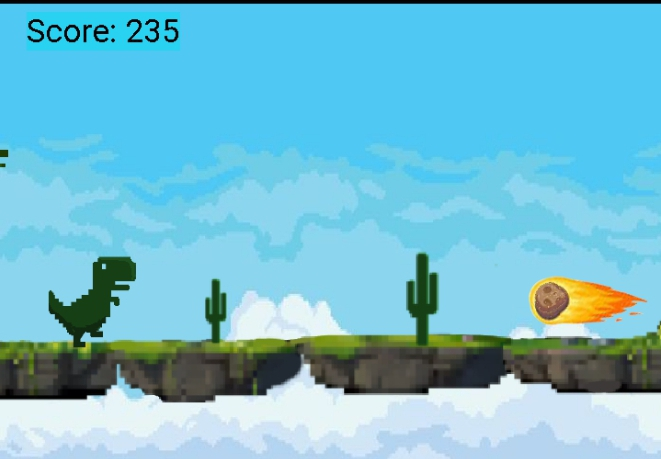

# About Project
This game project was inspired by Google chrome browser's offline mode game, Dino run This recreation (for mobile screens) seeking to take the original game to a different level in aesthetics especially was a challenge meant to improve my programming and game development skills. Note that it is public and available for open sourcing.

# Screenshot of the original game

# Here are some screenshots of the project
# Menu SCreen

# Gameplay Screen

# Game Over Screen

# How you can contribute to this pygame project 
1. Work on the screen orientation; change it to a landscape view
2. Add some more dynamic enemy objects 
3. Improve the asset arts with sprite sheets
4. Organize the codes by putting separate functionalities into separate files
5. Add UI to the game
6. Add suitable comments to the codes
7. Simple txt database for score keeping.
8. Any helpful contribution is welcome.
